- title : Polyglot data science
- description : Polyglot data science with F#, R and D3.js
- author : Evelina Gabasova
- theme : white
- transition : none

***

# Polyglot data science
# 
 the force awakens 

## with F#, R and D3.js

 

- Evelina Gabasova **@evelgab**
- Tomas Petricek **@tomaspetricek**

********

# Part I
## F# with type providers

---------

# [fslab.org](http://www.fslab.org): Doing data science using F#

The data science workflow

 - _Data access_ with type providers
 - _Interactive analysis_ with .NET and R libraries
 - _Visualization_ with HTML/PDF charts and reports

High-quality open-source libraries

---------

# LINQ before it was cool :-)

    [lang=csharp]
    var res = StockData.MSFT
      .Where(stock => stock.Close - stock.Open > 7.0)
      .Select(stock => stock.Date)

 

## Looking under the cover

 - _Extension methods_ take `Func<T1, T2>` delegates
 - _Immutable_ because it returns a new `IEnumerable`
 - Functional design allows method chaining

---------

# LINQ before it was cool :-)

    StockData.MSFT
    |> Array.filter (fun stock -> stock.Close - stock.Open > 7.0)
    |> Array.map (fun stock -> stock.Date)

 

## Looking under the cover

 - _Pipeline operator_ for composing functions
 - _Lambda functions_ written using `fun`
 - Immutable lists, sequences, arrays, etc.

---------

# Charting libraries for F#

 - [XPlot](http://tahahachana.github.io/XPlot/) - cross platform, HTML-based (recommended)
 - [F# Charting](http://fslab.org/FSharp.Charting/) - flexible but Windows-only library
 - Other options: [FnuPlot](http://fsprojects.github.io/FnuPlot/) and
     [R provider](http://bluemountaincapital.github.io/FSharpRProvider)

 
 

## For latest information

 - See [FsLab.org](http://fslab.org/) - the F# data science homepage

---------

# Charting with XPlot

Draw `sin` for values from $0$ to $2\pi$:

    [| 0.0 .. 0.1 .. 6.3 |]
    |> Array.map (fun x -> x, sin x)
    |> Chart.Line

Uses _Google Charts_ behind the scenes:

---------

# What are type providers?

---------

# Type provider patterns

Providers for a _specific data source_

    let wb = WorldBankData.GetDataContext()
    wb.Countries.India.Indicators.``Population, total``

Parameterized provider for a _data format_

    type Rss = XmlProvider<"data/bbc.xml">
    Rss.Load(url).Channel.Description

---------

# TASK: Star Wars movie profits

--------

# [github.com/evelinag/polyglot-data-science](https://github.com/evelinag/polyglot-data-science)

*********

# Part II
## Visualization with D3.js

--------

# The Star Wars social network

<a href="images/episode7-interactions.html">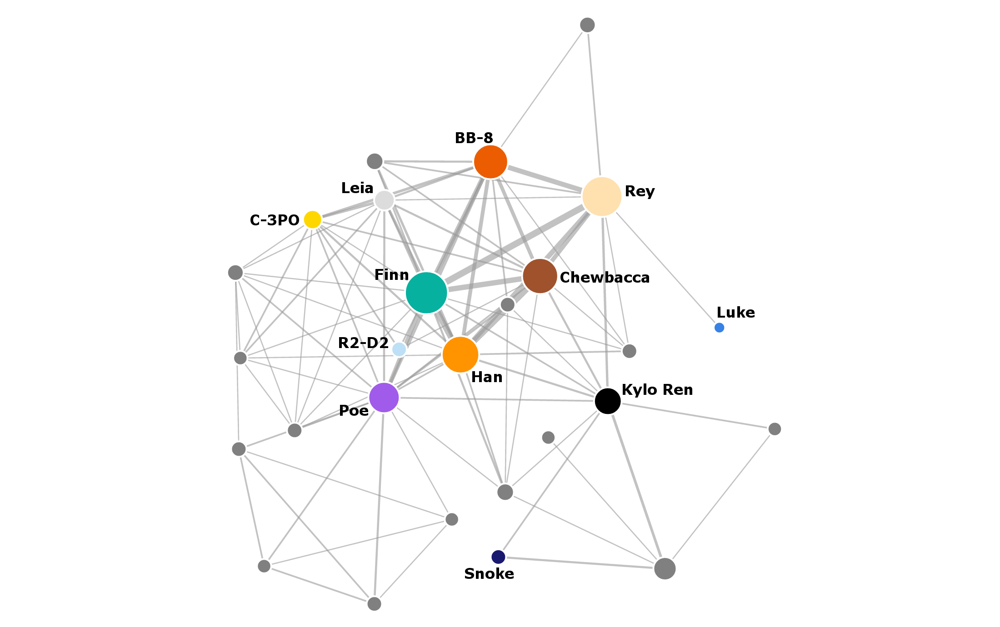 </a>

--------

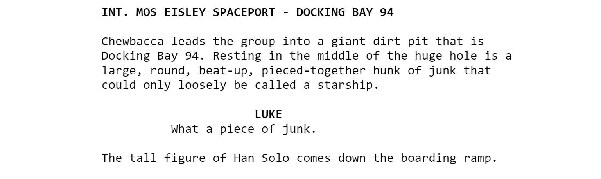

--------

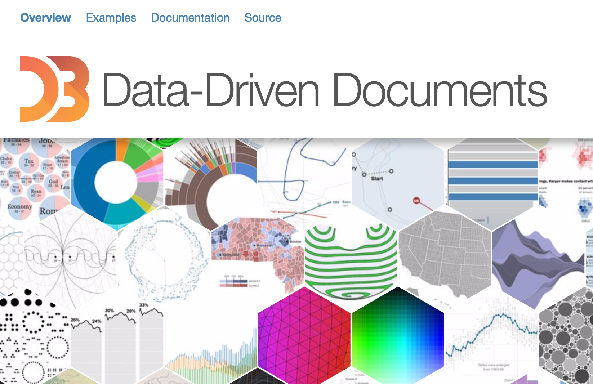

--------
# D3.js visualizations
## made easier

[Gallery of examples](https://github.com/mbostock/d3/wiki/Gallery)

--------

# D3.js social network visualization

[Force-directed network layout](http://bl.ocks.org/mbostock/4062045)

*********

# Part III
## Analyzing social networks with R

--------

# Social network analysis

* Who is the most central character?
* How to the movies compare between themselves?

-------

# The R language

- "domain-specific" language for statistical analysis

-----

# Very quick R intro

    [lang=R]
    # assignment
    x <- 1
    x = 1

    # variable and function names
    x
    x.y
    read.csv

-----

# Very quick R intro: pipeline
## |> turns into %>%

    [lang=R]
    install.packages("magrittr")
    library(magrittr)

    xs <- c(1,2,3,4,5,6,7,8,9,10)
    xs %>% mean

-----

# Network analysis with igraph

- [igraph website](http://igraph.org/r/)
- [igraph documentation](http://igraph.org/r/doc/)

    [lang=R]
    install.packages("igraph")
    library(igraph)

-----

# Creating igraph network

    [lang=R]
    library(igraph)

    g <- graph(edges)

- *edges* = list of nodes

n1, n2, n3, n4, n5, ...  
*represents*
(n1, n2), (n3, n4), ...

-----

# Calculating degree

    [lang=R]

    d <- degree(graph)

-----
- data-background : #212d30

# F#

    open RProvider.igraph

    let degree = R.degree(network)

-----

- data-background : #212d30

# F#
export JSON into list of edges

# R
perform the network analysis

-----
# Degree
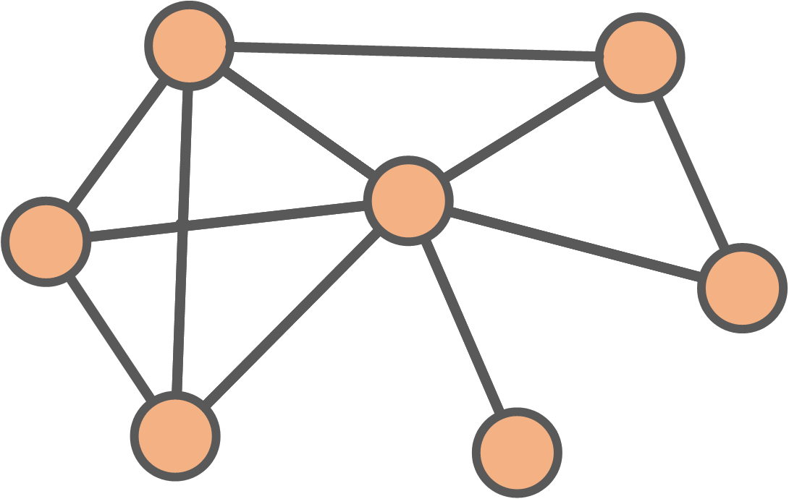

-----
# Degree
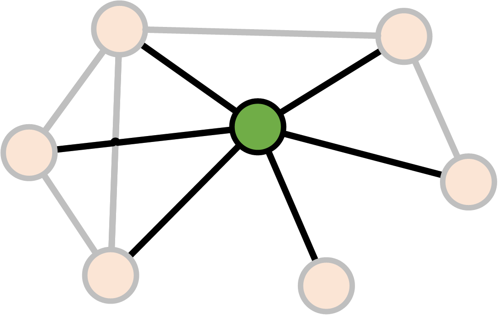

-----
# Degree

------
# Degree

 

$$$
\text{Degree}(v) = \text{Number of links }v \leftrightarrow v' \\
v \neq v'

-----
# Betweenness

-----
# Betweenness

-----
# Betweenness
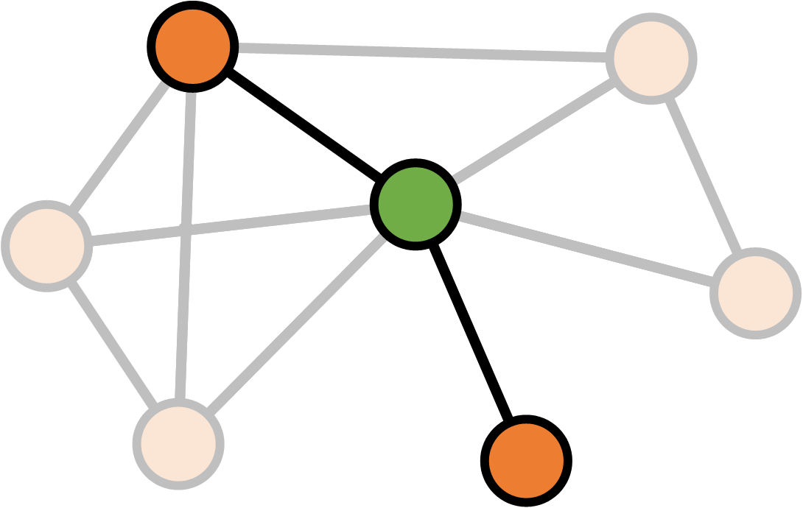

-----
# Betweenness

-----
# Betweenness
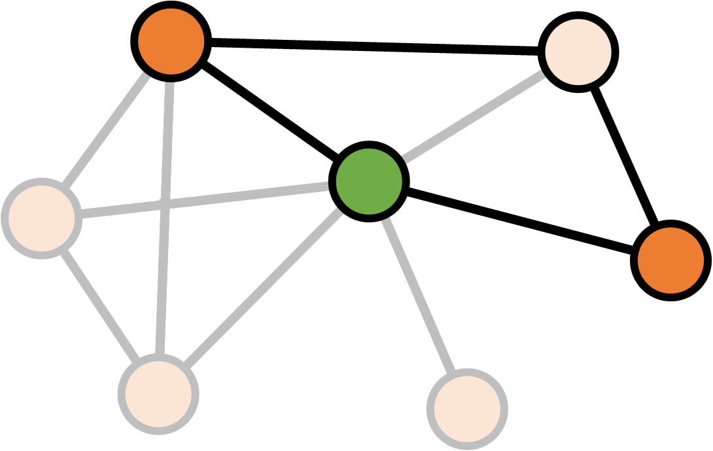

-----
# Betweenness

 

$$$
S_v = \text{Number of shortest paths between $a$ and $b$ through $v$} \\
S = \text{Number of shortest paths between $a$ and $b$} \\ \\
\text{Betweenness}(v)_{ab} = \frac{S_v}{S}

-----
# Betweenness

 

$$$
S_v = \text{Number of shortest paths between $a$ and $b$ through $v$} \\
S = \text{Number of shortest paths between $a$ and $b$} \\ \\
\text{Betweenness}(v) = \sum_{ab} \frac{S_v}{S}

-----
# Network structure

How do the the movies differ?

- Size
- Density
- Clustering coefficient

-----
- data-background : images/senate.jpeg

-----
# Density

-----
# Density
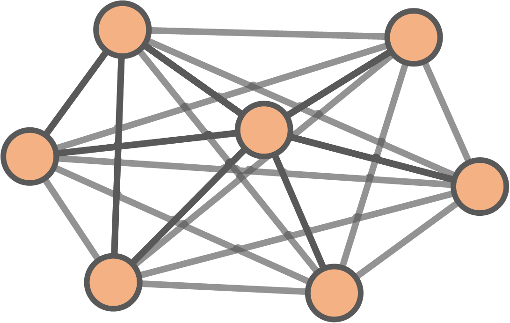

-----
# Density

 

$$$
\begin{align}
\text{Density} &= \frac{\text{Existing connections}}{\text{Potential connections}} \\
& \\
&= \frac{\text{Existing connections}}{\frac{1}{2}N(N-1)}
\end{align}

-----
# Clustering coefficient

-----
# Clustering coefficient

-----
# Clustering coefficient
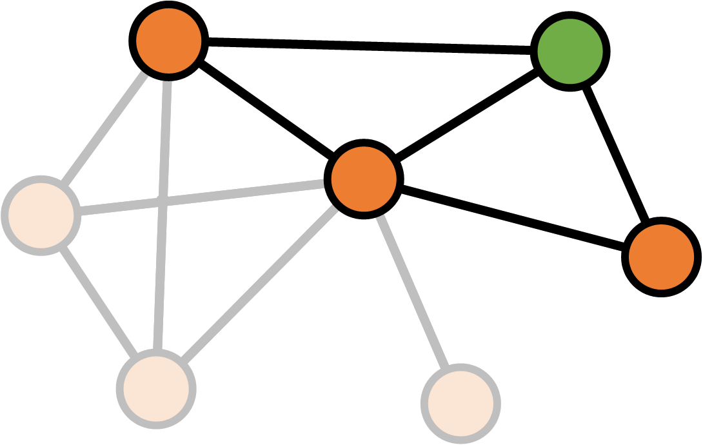

-----
# Clustering coefficient

-----
# Clustering coefficient
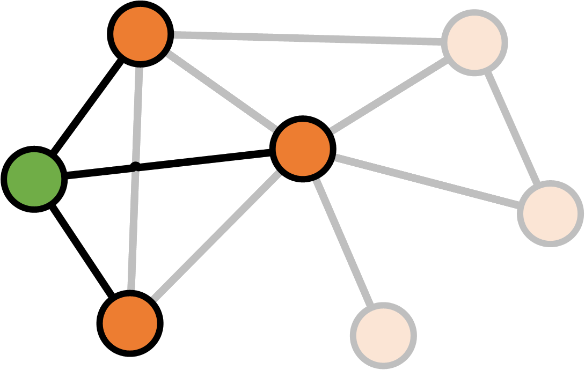

-----
# Clustering coefficient

-----
# Clustering coefficient

 

$$$
K_v = \text{Number of neighbours of $v$} \\
E_v = \text{Number of links between neighbours of $v$} \\ \\
\text{Clustering}(v) = \frac{E_v}{\frac{1}{2} K_v (K_v - 1)}

-----
# Clustering coefficient

 

$$$
K_v = \text{Number of neighbours of $v$} \\
E_v = \text{Number of links between neighbours of $v$} \\ \\
\text{Clustering}(\text{network}) = \frac{1}{N} \sum_v \frac{E_v}{\frac{1}{2}  K_v (K_v - 1)}

-----
# 
 Size 

-----
# 
 Density 

--------

# 
 Clustering coefficient 

--------

- data-background : images/kyloapproves-loop3.gif

********

# CONCLUSIONS

--------

non-profit _books and tutorials_

_cross-platform_ **community** data science

## F# Software Foundation

commercial support **open-source** _contributions_

machine learning **[www.fsharp.org](http://www.fsharp.org)** web and cloud

consulting  _user groups_ research

--------

# The Learning Pyramid

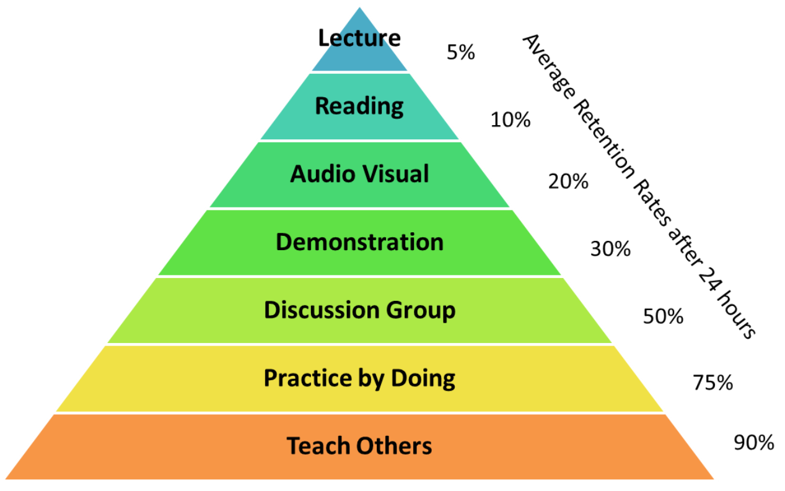

----------------------------------------------------------------------------------------------------

## Community chat and Q&A

 - **#fsharp** on Twitter
 - **StackOverflow** F# tag

## Open source on GitHub

 - **Visual F#** repo
   [github.com/Microsoft/visualfsharp](http://github.com/Microsoft/visualfsharp)
 - **F# Compiler** and core libraries
   [github.com/fsharp](http://github.com/fsharp/)
 - **F# Incubation** project space
   [github.com/fsprojects](http://github.com/fsprojects/)
 - **FsLab** Organization repository
   [github.com/fslaborg](http://github.com/fslaborg/)

## More resources

 - Scott Wlaschin's [fsharpforfunandprofit.com](http://fsharpforfunandprofit.com/)

----------------------------------------------------------------------------------------------------

# F# Books and Resources

## [fsharp.org/about/learning.html](http://fsharp.org/about/learning.html)

----------------------------------------------------------------------------------------------------

# 
The Force Awakens 

 

**Evelina Gabasova**

  - [@evelgab](http://twitter.com/evelgab)
  - [evelina@evelinag.com](mailto:evelina@evelinag.com)
  - [www.evelinag.com](http://evelinag.com)

**Tomas Petricek**

 - [@tomaspetricek](http://twitter.com/tomaspetricek)
 - [tomas@tomasp.net](mailto:tomas@tomasp.net)
 - [www.tomasp.net](http://tomasp.net)
